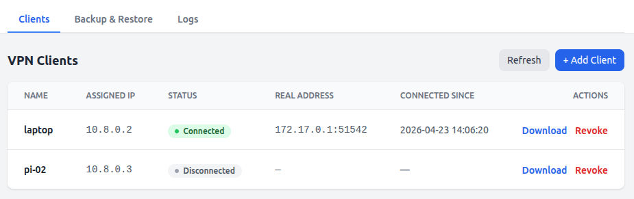

# OpenVPN UI

A self-contained Docker image running a OpenVPN server with a web-based admin UI for managing clients.



## Features

- **Web Admin UI** — Alpine.js + Tailwind CSS frontend served by FastAPI
- **Client Management** — Generate, download, and revoke client `.ovpn` configurations
- **Persistent IPs** — Each client gets a fixed VPN IP address across reconnections
- **Backup & Restore** — Download/upload full configuration backups as zip files
- **Log Viewer** — View OpenVPN logs in real-time from the browser
- **Connected Clients** — See which clients are online and their assigned IPs
- **Easy-RSA PKI** — Certificate management using Easy-RSA
- **Single Volume** — All state stored in one Docker volume (`/data`)

## Quick Start

```shell
docker run -d \
  --name openvpn-ui \
  --restart unless-stopped \
  --cap-add=NET_ADMIN \
  --sysctl net.ipv4.ip_forward=1 \
  --device /dev/net/tun \
  -p 1194:1194/udp \
  -p 1180:80 \
  -v openvpn-ui-data:/data \
  -e ADMIN_PASSWORD=changeme \
  -e VPN_HOST=your.public.ip.or.hostname \
  ghcr.io/fjaderboll/openvpn-ui:latest
```

Then open `http://localhost:1180` and log in with `admin` / `changeme`.

See [setup.md](doc/setup.md) for more ways to setup this up including routing.

## Environment Variables
These variables can be passed when you start the container:

| Variable          | Default value      | Description                           |
| ----------------- | ------------------ | ------------------------------------- |
| `ADMIN_USERNAME`  | `admin`            | Admin login username                  |
| `ADMIN_PASSWORD`  | `changeme`         | Admin login password                  |
| `VPN_HOST`        | `vpn.mydomain.com` | Public hostname/IP for client configs |
| `VPN_PORT`        | `1194`             | OpenVPN listen port                   |
| `VPN_PROTO`       | `udp`              | OpenVPN protocol (`udp` or `tcp`)     |
| `VPN_SUBNET`      | `10.8.0.0`         | VPN subnet                            |
| `VPN_SUBNET_MASK` | `255.255.255.0`    | VPN subnet mask                       |

> [!NOTE]
> Some of these will be persisted in your volume, so if running a second time with
> other values, you may need to clear the volume or manually update `/data/config/server.conf`
> inside the container.

## Required Docker Permissions

- `--cap-add=NET_ADMIN` — Required for TUN device and iptables
- `--sysctl net.ipv4.ip_forward=1` — Required for routing VPN traffic
- `--device /dev/net/tun` — Required for OpenVPN tunnel interface

## Volume

All configuration and state is stored in `/data`:

```shell
/data/
├── pki/            # Easy-RSA PKI (CA, certs, keys)
├── ccd/            # Client-config-dir (persistent IPs)
├── config/         # server.conf + client.conf.template
├── clients/        # Generated .ovpn files
├── logs/           # OpenVPN logs and status
└── ip_assignments.json
```

To clean all settings:
```shell
docker rm -f openvpn-ui
docker volume rm openvpn-ui-data
```

## Local building and testing

```shell
# build
docker build -t openvpn-ui .

# run server
docker run -it \
  --rm \
  --name openvpn-ui \
  --cap-add=NET_ADMIN \
  --sysctl net.ipv4.ip_forward=1 \
  --device /dev/net/tun \
  -p 1194:1194/udp \
  -p 1180:80 \
  -v openvpn-ui-data:/data \
  -e ADMIN_PASSWORD=changeme \
  -e VPN_HOST=localhost \
  openvpn-ui

# head to http://localhost:1180 and create a client and test it
openvpn --config client.conf
```
